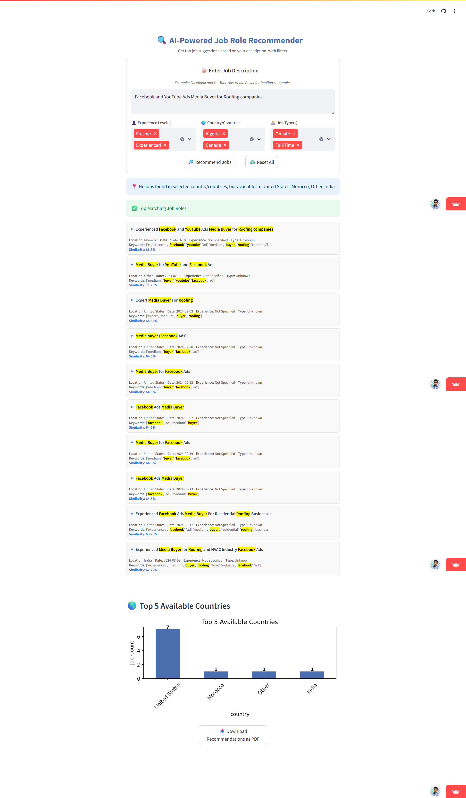

# 💼 Job Market Analysis & Recommendation System

[](https://debasis-baidya-job-recommendation-engine-project-8.streamlit.app/)
[](https://www.python.org/)
[](LICENSE)
[](https://ipython.org/)
[](https://docs.python.org/3/library/collections.html)
[](https://colab.research.google.com/)
[](https://matplotlib.org/)
[](https://www.nltk.org/)
[](https://numpy.org/)
[](https://docs.python.org/3/library/os.html)
[](https://pandas.pydata.org/)
[](https://docs.python.org/3/library/pickle.html)
[](https://plotly.com/)
[](https://docs.python.org/3/library/re.html)
[](https://seaborn.pydata.org/)
[](https://scikit-learn.org/)
[](https://www.statsmodels.org/)
[](https://docs.python.org/3/library/warnings.html)
[](https://amueller.github.io/word_cloud/)

This is a fully working end-to-end Job Role Recommendation Engine I built using Python, Machine Learning, and NLP. The app takes a custom job description from the user and returns the top 10 most relevant jobs using semantic matching and multiple filters. I built it from scratch – from data wrangling and modeling to Streamlit deployment.

🔗 **Live Tool/App**: [Streamlit Link](https://debasis-baidya-job-recommendation-engine-project-8.streamlit.app/)  
▶️ **App Demo**: [Video Link](https://youtu.be/Sr9g2UNLS5g)

---

## 🧠 Problem Statement

Given a job description written by a user, recommend the most relevant job postings by analyzing and comparing job roles, keywords, and metadata like location, experience level, and job type.

---

## 📂 Project Structure

```
├── Task 1 & 2.ipynb       # Data cleaning, EDA, and initial processing
├── Task 3 - 5.ipynb       # Feature engineering, vectorization, model building
├── Task 6 - 8.ipynb       # Evaluation, enhancements, UI logic
├── Recommender.py         # Streamlit app (deployed)
├── job_data.csv           # Cleaned dataset (not uploaded)
├── vectorizer.pkl         # Saved TF-IDF vectorizer
├── job_recommender_model.pkl  # Saved KNN model
```

---

## ✅ Step-by-Step Workflow

### 🔹 **1. Data Cleaning & EDA** – `Task 1 & 2.ipynb`
- Loaded the raw job postings dataset and fixed formatting issues
- Standardized columns like `experience`, `location`, and `country`
- Filled missing values in `keywords` and other fields logically
- Parsed and formatted `published_date` for time-series analysis
- Explored most common keywords, countries, and job types to understand distribution

---

### 🔹 **2. Text Preprocessing & Feature Engineering** – `Task 3 - 5.ipynb`
- Created a new column `processed_text` by combining job `keywords`, title, and description
- Applied basic NLP:
  - Lowercasing
  - Removing punctuation and digits
  - Removing stopwords (where applicable)
- Applied **TF-IDF vectorization** on `processed_text`
- Used `TfidfVectorizer` from `scikit-learn` and saved it using `pickle`
- Checked sparsity and shape of the TF-IDF matrix to ensure proper representation

---

### 🔹 **3. Similarity-Based Model Building** – `Task 3 - 5.ipynb`
- Built a **K-Nearest Neighbors** model (`sklearn.neighbors.NearestNeighbors`)
- Trained it on the TF-IDF matrix to find semantically similar job descriptions
- Tuned the number of neighbors (`n_neighbors=10`)
- Saved the final trained model as `job_recommender_model.pkl`

---

### 🔹 **4. Evaluation & Smart Filtering** – `Task 6 - 8.ipynb`
- Tested the model with different custom queries like:
  - *“Facebook and YouTube Ads Buyer”*
  - *“Data Analyst with Excel and SQL”*
- Created fallback logic when no match is found in selected filters (suggests top countries instead)
- Engineered additional columns:
  - `experience` extracted from keywords
  - `job_type` extracted using regex from description/keywords
- Grouped data by country and job type to create insights for UI

---

### 🔹 **5. App Building & Deployment (Streamlit)** – `Recommender.py`
- Built an intuitive and responsive frontend using Streamlit
- Features of the UI:
  - 🔎 **Text input** for job description
  - 🎛 **Multiselect filters** for Experience, Country, and Job Type
  - 📊 **Bar chart** showing top countries
  - 📄 **Download as PDF** button with FPDF integration
  - ✨ **Keyword highlighting** using HTML `<mark>` tags in results
- All session state and reset logic handled using Streamlit’s `st.session_state`
- App auto-reruns on reset or submit, ensuring clean UX

---

## 📸 App Preview



> Screenshot of Hosted Streamlit Dashboard.

---

## 🌟 Features Summary

- ✅ User inputs any free-text job description
- 🔍 Matches top 10 most relevant job postings using semantic similarity
- 🎯 Filters results by:
  - Experience (Fresher / Experienced)
  - Country (based on dataset)
  - Job Type (Remote / Hybrid / Freelance / On-site / Contract, etc.)
- 📊 Visuals to show top countries with most matching jobs
- 📄 Option to **download recommendations as PDF**
- 🚫 Gracefully handles vague queries or missing data

---

## 🧰 Tools & Libraries Used

| Category         | Tools / Packages                               |
|------------------|------------------------------------------------|
| Language         | Python                                          |
| Data Handling    | Pandas, NumPy                                   |
| NLP              | TF-IDF Vectorizer, Regex                        |
| ML Model         | KNN (Nearest Neighbors) from scikit-learn       |
| Visualization    | Matplotlib                                      |
| Web App          | Streamlit                                       |
| Export           | FPDF                                            |
| Storage          | Pickle                                          |

---

## 💡 What I Learned

- Implemented a job matching engine using pure NLP without large LLMs
- Learned how to blend vector-based recommendations with user filtering logic
- Improved user experience with fallback logic and PDF download
- Designed a real-world solution from raw data to deployed UI

---

## 🚀 How to Use It

1. Visit the Streamlit app 👉 [Click here](https://debasis-baidya-job-recommendation-engine-project-8.streamlit.app/)
2. Enter a custom job description
3. Optionally select experience, job type, and country
4. Hit **Recommend Jobs** to get your personalized top 10 job matches
5. Download results as a PDF

---

## 📬 About Me

**Debasis Baidya**  
Senior MIS | Data Science Intern  
✅ 80%+ automation of manual processes at my workplace  
📊 Skilled in Power BI, Python, SQL, ML, DL, NLP, Google Apps Script, Google Site  
📫 Connect: [LinkedIn](https://www.linkedin.com/in/debasisbaidya)

---

> ⭐ If you liked the project or learned something from it, give it a star and share feedback. Thank you!
